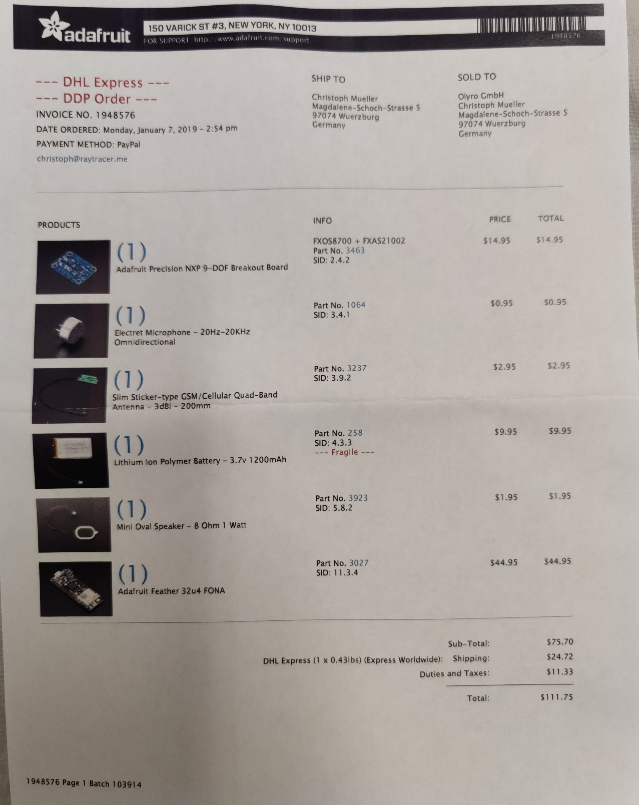
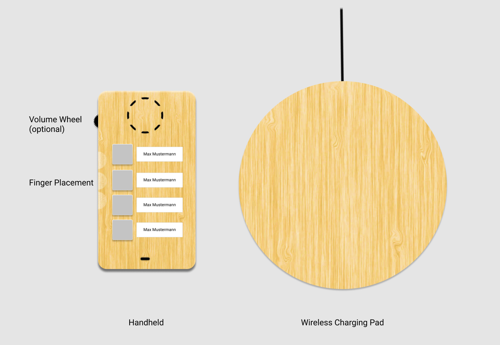

A project that I have been working on for a while, but could unfortunately not finish for private reasons is the construction of a cell phone for senior citizens (of course not limited to this user group). Especially users on the low end of the "technology capability scale". The basic requirements:

- no display
- no menu structures to navigate
- as few buttons as possible
- buttons that directly map to a recipient
- gesture based usage (pick up the phone -> accept call, put down the phone -> stop call)
- robust (must take a fall) e.g. made from wood
- Charge wirelessly

Now this phone is **not** intended for users who would be just fine with a regular phone and just need bigger buttons. This phone is made for users you cannot understand the navigation in any kind of menu/list structure (may it be recent calls or a phone book). It is directed at users who do not know what button to press when they want to accept, decline or stop a call. Hence, it has to be gesture based. While it is certainly not difficult to design a set of basic gestures it would be very difficult to make them robust enough for real world use. Remember this is not an android smartphone "toy" function which you try for 5 minutes and then go back to swiping/pressing buttons this is the **only** way to interact with the phone hence it must work absolutely flawlessly.

I started to work on basic gesture handling with the following setup:

The Feather 32u4 FONA is a microcontroller with a built-in modem to make and receive calls. I would connect the microphone and the speaker to it to create a basic prototype. The NXP 9-DOF chip would detect the current orientation. This happens partially in software which makes the chip cheaper. The downside for this is that a lot of memory is taken up by the code that processes the incoming data to calculate the orientation. Combine that with the code that makes/receives phone calls or text messages and already >75% of the available flash storage is used up. For this prototype this might be fine, but for a production device we might be in trouble now. It is all powered by a 1200mAh 3.7v battery (see below for the full part list).

While I got the basic sending of text messages and basic gesture handling to work (the provided adafruit arduino libraries help tremendously here) I had to stop development shortly after, but my rough basic design would have looked like something below. 

Hopefully I can return to this project at one point in the future :)
