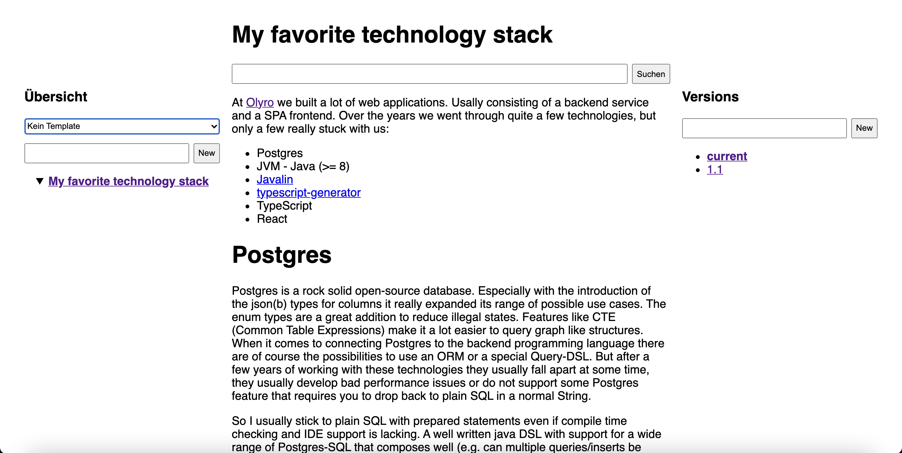
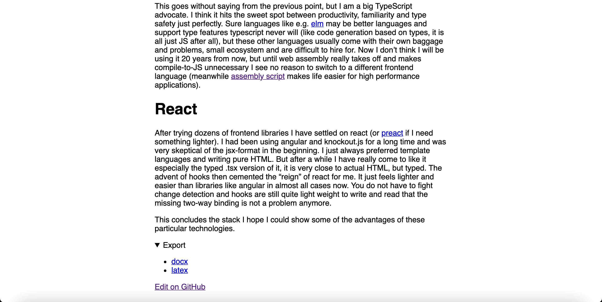

At [Olyro](https://olyro.de/) we have implemented a ISO 9001:2015 conformant quality management system (QMS). It is basically a mix of word/pdf files for the procedures and [notion.so](https://notion.so) documents for the actual project specific documents and records. And while notion provides a lot features for building a document management system we are not 100% happy with it. 

The API has just arrived in Beta form (even after over 2 years of using notion), the responsiveness even though it has been improved is still lacking and we have had one or two outages (thankfully not during an audit). It also lacks features for versioning/tagging documents properly (QMS documents/procedures must have a version + be released properly by an authorized person). It can be build manually of course, but that is far from ideal.

That got me thinking of a more simple solution. I wanted a statically generated document management system that is very simple and provides only a couple of features:

- A tree structure of documents
- Based on Markdown inlcuding yaml frontmatter for metadata
- Markdown -> HTML rendering of documents
- A simple full text search
- Optionally releasing documents with a version number
- Exporting documents to various formats (.docx, .tex, .pdf etc.)
- Creating new documents based on templates
- Connection to GitHub/gitlab etc. for convenience when creating new documents or editing existing ones
- Backed by a tree folder structure that can be edited using familiar tools
- A CI pipeline that builds static html files that can be served via apache/nginx/caddy

It took me about a week to build a simple prototype with about 100 lines of python for the static site generator and another 100 lines of Go for the server (static file serving + endpoints for converting/searching etc.). The heavy lifting of converting is done by [pandoc](https://pandoc.org/). Search is done with [ripgrep](https://github.com/BurntSushi/ripgrep) (`--json` to the rescue). The system works without javascript and uses only a bit of css (mostly taken from [mvp.css](https://andybrewer.github.io/mvp/)). I am quite happy with the result. It works as intended and is small enough to be ported to pretty much any language. It obviously won't scale beyond a couple of thousand documents, but for a lot of QMS implementations that would be plenty.

For now we will of course keep using notion, since all of our existing documents already live there. And notion provides superior editing capabilities (let alone the database functionality which is super powerful). But I will explore this system further for private use.

