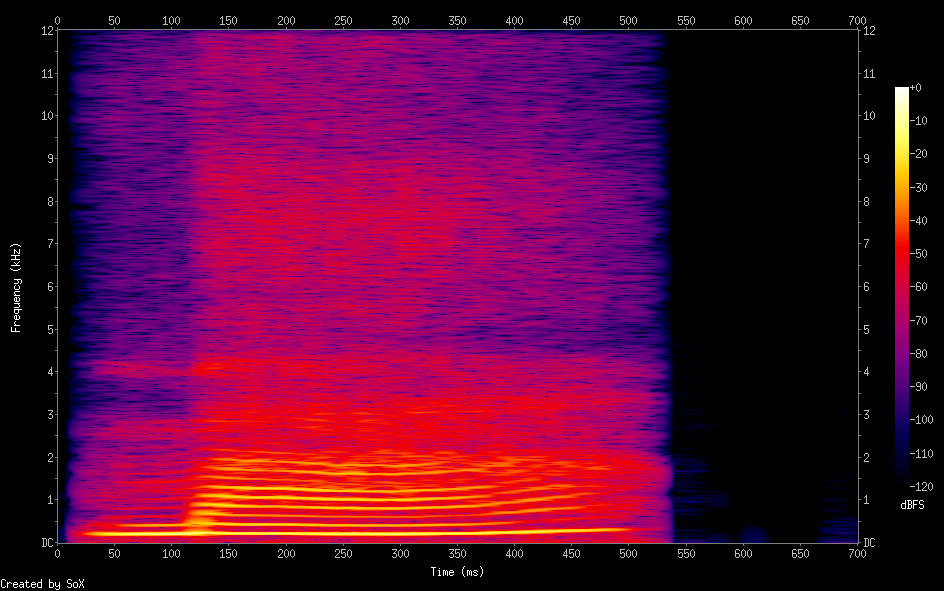

For quite a while I have been studying Vietnamese now. Mostly just a couple of minutes after work. And while grammar and vocabulary is slowly improving the difficult intonation of vietnamese makes learning it quite frustrating. Words like ma, má, mà, mã, mạ and mả all are pronounced slightly differently. Practicing is of course best done with a native speaker, but what if you do not have anyone to practice with?

Here the idea to create an android app comes into play. My first try was to use the in-built android voice recognition service and compare what the user said to what he/she should have been saying. But that quickly showed that the in-built speech recognition is not suitable at all for this kind of task. It is highly optimzied for sentences and common word combinations. So it will default to correct to phrases that sound similar if those are more common. Great for dictating a long paragraph, but useless for intonation practice.

The next idea was to analyze the spectrum of the spoken word(s) and compare it to what a native spectrum looks like. The first idea was to compare the spectrum itself, but I quickly turned to a machine learning like approach. I found some articles recommending a RNN based solution where a slice of the spectrum would be mapped to a letter. The problems I had with this approach:

- it could have similiar issues like the in-built Android speech recogntion namely preferring more likely sounds based on preceding ones instead of the actual spoken ones
- it requires a ton of training data
- it requires that the training data and test data is labeled (obviously)



## GGP (Cartesian Genetic Programming)

So instead I turned to my favorite algorithm called CGP (Cartesian Genetic Programming). This basically generates a computation graph generated from a fixed $n \times m$ grid. There is a great paper discussing the current state of CGP that you can find [here](https://link.springer.com/content/pdf/10.1007/s10710-019-09360-6.pdf). CGP can produce fairly general solutions including neural networks. There are even approaches for integrating gradient descent into CGP, but I have not yet explored this direction.

My CGP program is written in Java and returns a python fragment that I can test against my data. The only really interesting part is the fitness function which is roughly described by taking all the predicted characters for every slice of the spectrum, concatenating them, removing duplicates and trimming the end result. That result is than compared to the actual word by using the levenshtein distance. That is the fitness value of a gene. I modified that slightly later, but it is still mostly how it works. The code is included at the end of the blog post.  

## Results

Let's be honest here, the results where absolutely terrible. This is a hard problem. The CGP program is probably the smallest problem here, but finding the right width and overlap of the spectrum slices is alone a complicated issue. I used scipys `signal` package to compute the spectra and export them to json. I let the CGP program run for a couple of days on my server with variying number of rows, columns, levelsBack and mutation rates. But it was not really going anywhere.

A better appoach for an app like this would probably just comparing the spectra themselves instead of trying to find a general solution for speech recognition.

Nevertheless here is the java code. The python code is only a couple of lines and basically just calles `signal.spectrogram(samples, sample_rate)` and dumps that to json, so not to exciting.


```java
package me.raytracer.cgpvietnamese;

import java.io.IOException;
import java.nio.file.Files;
import java.nio.file.Paths;
import java.util.AbstractMap;
import java.util.Arrays;
import java.util.Collections;
import java.util.Map;
import java.util.TreeMap;
import java.util.concurrent.ThreadLocalRandom;
import java.util.stream.Collectors;

import org.apache.commons.text.similarity.LevenshteinDistance;
import org.json.JSONArray;
import org.json.JSONException;

public class Main {
    public static int rows = 129;
    public static int columns = 7;
    public final static int maxArity = 2;
    public final static int nrOutputs = 9;
    public final static int nrInputs = 129;
    public final static int nrFunctions = 6;
    public static int maxLevel = 3;

    public static double mutationRate = 0.1;
    public final static int geneLength = rows * columns * (maxArity + 1) + nrOutputs;

    public static void main(String[] args) {
        try {
            if (args.length > 3) {
                rows = Integer.parseInt(args[0]);
                columns = Integer.parseInt(args[1]);
                mutationRate = Double.parseDouble(args[2]);
                maxLevel = Integer.parseInt(args[3]);
            }

            System.out.println("Rows: " + rows);
            System.out.println("Columns: " + columns);
            System.out.println("Mutation Rate: " + mutationRate);

            var testData = readTestData();
            var gene = new int[geneLength];
            generate(gene);
            var fitness = Double.MAX_VALUE;
            var iterations = 0;

            while (fitness > 0.01) {
                try {
                    var copies = generateNCopies(gene, 4);
                    for (int i = 0; i < copies.length; i++) {
                        var copyFitness = testFitness(copies[i], testData, false);
                        if (copyFitness <= fitness) {
                            if (copyFitness < fitness) {
                                System.out.println("Fitness: " + copyFitness);
                            }
                            fitness = copyFitness;
                            gene = copies[i];
                        }
                    }
                } catch (Exception e) {
                    e.printStackTrace();

                    return;
                }

                if (iterations % 10000 == 0) {
                    System.out.println("Nach Iteration:" + iterations);
                    System.out.println(print(gene));
                }

                iterations++;
            }
            testFitness(gene, testData, true);
            System.out.println("success after nr of iterations: " + iterations);
            print(gene);
        } catch (JSONException e1) {
            e1.printStackTrace();
        } catch (IOException e1) {
            e1.printStackTrace();
        }

    }

    public static Map<String, JSONArray> readTestData() throws IOException {
        return Files.list(Paths.get(".")).filter(p -> p.getFileName().toString().endsWith("json")).map(p -> {
            try {
                return new AbstractMap.SimpleEntry<String, JSONArray>(p.getFileName().toString().replace(".json", ""),
                        new JSONArray(Files.readString(p)));
            } catch (IOException e) {
                throw new RuntimeException(e);
            }
        }).collect(Collectors.toMap(k -> k.getKey(), k -> k.getValue()));
    }

    public static int[][] generateNCopies(int[] gene, int nr) {
        var list = new int[nr][];

        for (int i = 0; i < nr; i++) {
            list[i] = Arrays.copyOf(gene, gene.length);
            mutate(list[i]);
        }

        return list;
    }

    public static double testFitness(int[] gene, Map<String, JSONArray> testData, boolean printRaw) {
        var fitness = 0d;

        for (var entry : testData.entrySet()) {
            var letters = new StringBuilder();
            var rawLetters = new StringBuilder();
            var frequency = new TreeMap<String, Integer>(Collections.reverseOrder());

            for (int i = 0; i < entry.getValue().length(); i++) {
                var inputJson = entry.getValue().getJSONArray(i);
                var inputs = new double[nrInputs];

                for (int j = 0; j < inputJson.length(); j++) {
                    inputs[j] = inputJson.getDouble(j);
                }

                int index = 0;
                var outputs = evaluate(gene, inputs);
                for (int j = 0; j < outputs.length; j++) {
                    if (outputs[j] > outputs[index]) {
                        index = j;
                    }
                }

                var s = indexToString(index);

                if (frequency.containsKey(s)) {
                    frequency.put(s, frequency.get(s) + 1);
                } else {
                    frequency.put(s, 1);
                }

                if (printRaw) {
                    rawLetters.append(s);
                }

                if (!letters.toString().endsWith(s)) {
                    letters.append(s);
                }
            }

            var top = frequency.keySet().stream().limit(entry.getKey().length()).toList();
            for (int si = 0; si < entry.getKey().length(); si++) {
                if (!top.contains(entry.getKey().substring(si, si + 1))) {
                    fitness += 1;
                }
            }

            fitness += new LevenshteinDistance().apply(entry.getKey(), letters.toString().trim());

            if (printRaw) {
                System.out.println(rawLetters);
            }
        }

        return fitness;
    }

    public static String indexToString(int index) {
        switch (index) {
            case 0:
                return " ";
            case 1:
                return "b";
            case 2:
                return "m";
            case 3:
                return "a";
            case 4:
                return "á";
            case 5:
                return "à";
            case 6:
                return "ã";
            case 7:
                return "ạ";
            case 8:
                return "ả";
            default:
                throw new IllegalArgumentException("unknown index: " + index);
        }
    }

    public static void mutate(int[] gene) {
        for (int i = 0; i < mutationRate * gene.length; i++) {
            var index = ThreadLocalRandom.current().nextInt(0, geneLength);
            gene[index] = generateSingle(index);
        }
    }

    public static int generateSingle(int index) {
        if (index < rows * columns * (maxArity + 1)) {
            if (index % (maxArity + 1) == 0) {
                return ThreadLocalRandom.current().nextInt(0, nrFunctions);
            } else {
                var maxColumn = 1 + index / rows / (maxArity + 1);
                var column = ThreadLocalRandom.current().nextInt(Math.max(0, maxColumn - maxLevel), maxColumn);
                if (column == 0) {
                    return ThreadLocalRandom.current().nextInt(0, nrInputs);
                } else {
                    return ThreadLocalRandom.current().nextInt(0, rows) * (maxArity + 1)
                            + rows * (column - 1) * (maxArity + 1) + nrInputs;
                }
            }
        } else {
            var column = ThreadLocalRandom.current().nextInt(Math.max(0, 1 + columns - maxLevel), 1 + columns);
            if (column == 0) {
                return ThreadLocalRandom.current().nextInt(0, nrInputs);
            } else {
                return ThreadLocalRandom.current().nextInt(0, rows) * (maxArity + 1)
                        + rows * (column - 1) * (maxArity + 1) + nrInputs;
            }
        }
    }

    public static void generate(int[] gene) {
        for (int i = 0; i < gene.length; i++) {
            gene[i] = generateSingle(i);
        }
    }

    public static double[] evaluate(int[] gene, double[] inputs) {
        var result = new double[nrOutputs];

        for (int i = 0; i < result.length; i++) {
            result[i] = evaluateSingle(gene, gene[geneLength - nrOutputs + i], inputs);
        }

        return result;
    }

    public static double evaluateSingle(int[] gene, int index, double[] inputs) {
        if (index < nrInputs) {
            return inputs[index];
        } else {
            switch (gene[index - nrInputs]) {
                case 0:
                    return gene[index + 1 - nrInputs] % 10;
                case 1:
                    return evaluateSingle(gene, gene[index + 1 - nrInputs], inputs)
                            + evaluateSingle(gene, gene[index + 2 - nrInputs], inputs);
                case 2:
                    return evaluateSingle(gene, gene[index + 1 - nrInputs], inputs)
                            - evaluateSingle(gene, gene[index + 2 - nrInputs], inputs);
                case 3:
                    return evaluateSingle(gene, gene[index + 1 - nrInputs], inputs)
                            * evaluateSingle(gene, gene[index + 2 - nrInputs], inputs);
                case 4:
                    return evaluateSingle(gene, gene[index + 1 - nrInputs], inputs)
                            / evaluateSingle(gene, gene[index + 2 - nrInputs], inputs);
                case 5:
                    return evaluateSingle(gene, gene[index + 1 - nrInputs], inputs);
                default:
                    throw new IllegalArgumentException("Invalid function: " + gene[index - nrInputs]);
            }
        }
    }

    public static String print(int[] gene) {
        var result = new StringBuilder();

        for (int i = 0; i < nrOutputs; i++) {
            result.append("outputs[");
            result.append(i);
            result.append("] = ");
            result.append(printSingle(gene, gene[geneLength - nrOutputs + i]));
            result.append("\n");
        }

        return result.toString();
    }

    public static String printSingle(int[] gene, int index) {
        if (index < nrInputs) {
            return "inputs[" + index + "]";
        } else {
            switch (gene[index - nrInputs]) {
                case 0:
                    return String.valueOf(gene[index + 1 - nrInputs] % 10);
                case 1:
                    return "(" + printSingle(gene, gene[index + 1 - nrInputs]) + " + "
                            + printSingle(gene, gene[index + 2 - nrInputs]) + ")";
                case 2:
                    return "(" + printSingle(gene, gene[index + 1 - nrInputs]) + " - "
                            + printSingle(gene, gene[index + 2 - nrInputs]) + ")";
                case 3:
                    return "(" + printSingle(gene, gene[index + 1 - nrInputs]) + " * "
                            + printSingle(gene, gene[index + 2 - nrInputs]) + ")";
                case 4:
                    return "(" + printSingle(gene, gene[index + 1 - nrInputs]) + " / "
                            + printSingle(gene, gene[index + 2 - nrInputs]) + ")";
                case 5:
                    return printSingle(gene, gene[index + 1 - nrInputs]);
                default:
                    throw new IllegalArgumentException("Invalid function: " + gene[index - nrInputs]);
            }
        }
    }
}

```

