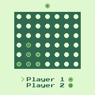

For a long time I have been interested in game development. I started when I was around 12 years old and got into 3d at the age of 16. I have always worked on small little projects or demos, but never really complete games. The biggest problem was underestimating the required work, loosing focus or just generally choosing the wrong tools. 3d graphics in particular can distract from game design by needing to focus on programming (DirectX, OpenGL, loading animations/models/textures, game architecture etc.), 3d modeling + rigging + animation, texture creation (diffuse, normal etc.) and sound/music all at the same time.

By restricting yourself to 2d you can focus more time on the game design itself (using predefined assets will also help with that in 3d). Another way to help create a result is to fit the development inside a fixed time box of x days (e.g. 2 days in a game jam). While this makes certain games difficult or even impossible to create, overall this will help produce an actual finished result.

## Reducing the Problem Space further

By choosing one of the many fantasy consoles out there (fictional, often severely restricted computers) you can reduce the of choices to made even further. There are quite a few options here (e.g. [PICO8](https://www.lexaloffle.com/pico-8.php)), but I chose [WASM4](https://wasm4.org/). WASM4 provides only 4 colors at a time, a resolution of 160x160 and a couple of channels for sound generation.  Furthermore RAM + Disk space is severely limited (64kb + 1kb). You can program it in basically any language that compiles to web assembly.

After choosing the console and the language ([AssemblyScript](https://www.assemblyscript.org/) in my case) I built my first little complete game in basically a single week as a side project. It is a clone of the _connect four_ classic. It is less than 500 lines long and features basic multiplayer functionality.

The reduction in possibility helps a lot to create an actual finished product. My final goal would be to build a Anno 1602 or Stronghold like game. Unfortunately WASM4 is a bit too restricted for that (I could see some simplified version of Anno working, but not Stronghold), so I need to find something else for that. I already experimented, but the problem is that without some restrictions you can really lose yourself in details instead of making progress.

The code for the game can be found [here](https://github.com/raytracer/four-it-is). Down below you can see a screenshot of the finished game.

{ width=300px }

