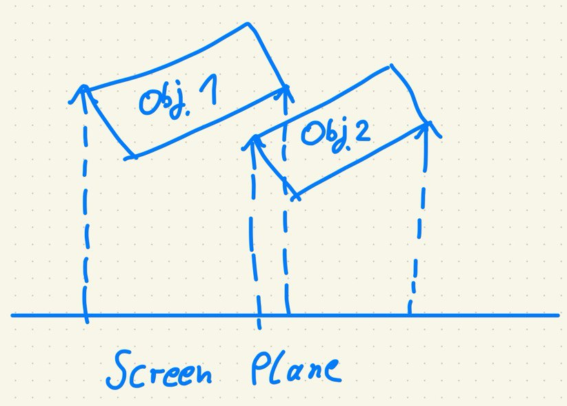

Recently I have gotten back into using Go as my main development language. Since I also wanted to experiment with game development I went to look for game engines in Go. I wanted to focus on 2d game engines and found [ebitengine](https://ebitengine.org/). It has a simple to use API and offers great examples. I especially like that the same image type can be used to draw from and to an image. So drawing to the screen from a sprite involves only a single type. Nice!

The game experiment I wanted to conduct was to build a 2.5D isometric game. The basic Tile has a dimension of 32 x 16 Pixels. Drawing a 2.5D isometric scene requires solving a difficult problem. How to determine the drawing order of the scene? This is quite hard and not obvious at all. [Here](https://shaunlebron.github.io/IsometricBlocks/) is a great explanation of this problem and a solution. It consists of two basic steps:

1. Create a dependency graph. What objects has to be drawn before what other object? In my game this will be simplified since I do not consider height in any way.
2. Use a topologic sort algorithm to create a list from the dependency graph. Be careful  though this can fail if there is a cycle present!

This took me a while to build as I did not need a 3d version. Here is a small visual explanation of my solution:

I basically trace 4 rays for every outer corner of every pair of rectangles. If the ray does not only hit the corner but the other rectangle as well, decide if the intersection point is closer to the camera. If it is it needs to be drawn after the other rectangle. For the topologic sort algorithm I used the [go-toposort](https://github.com/philopon/go-toposort) library.

To conclude the experiment I included the [resolv](https://github.com/solarlune/resolv) library to perform basic collision checks. The finished experiment includes a placeholder for the player that can shoot a "fireball" projectile and a set of columns on a basic level grass like surface. 

Maybe I will continue to further develop this prototype in the future :)