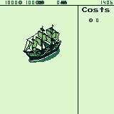

I have been working with so called fantasy consoles for about 4 years. I have
already written about my experience using wasm4
[here](./2022-10-23_game_development_with_wasm4.html). Fantasy console are
basically programming/execution environments with a set of usually quite
restrictive constraints (e.g. limited resolution, input methods, memory etc.).
These really help with creativity and producing an actual result, instead of
bike shedding and never actually producing anything.

## WASM-4

My favorite platform up until last year was WASM-4. It allows you to use
compiled languages (as long as they target wasm) and has even basic online
multiplayer support. Unfortunately support for the Go version has been quite
bad in recent releases. They have been relying on tinygo, but problems with
memory management are still present. Maybe with upcoming wasm support from go
itself these problems will go away (though I would be worried about the
resulting cart size), but for now they remain.

It also has no inbuilt tooling like a text editor, sprite editor or sound
editor (though there are third party carts for the
[latter](https://wasm4.org/play/iwas)). That means you can use your already
existing favorite tooling, but it also means it is a less integrated workflow
than e.g. Pico8.

Being limited to 4 colors is also quite restrictive and makes the import of
sprites a bit tedious (they are basically converted into byte arrays of the
host language). Since one color is used for transparency you are limited to 3
colors per sprite. That is just not enough for a lot of games.

My last game for WASM-4 was an [Anno 1602
demake](https://github.com/raytracer/wasm4-islands) which used pushed the
limits of the WASM-4 color "space". But working around the memory problems and
restriction (64kb) was a bit tedious and was costing motivation. I didn't
really added any music, but that basic game play loop was close to finished.

{ width=300px }

{ width=300px }

## Generative AI

For this last game I was also using generative AI for the first time (on the
topic of game development that is). On two fronts the use was quite successful.

### Sprite Creation

All sprites in the game are AI generated (with the exception of the resources
in the header). They are generated with a [SD 1.5 base model tuned for pixel
art](https://civitai.com/models/195730/aziibpixelmix). The result gets down
sampled 8 times and color corrected via a [web ui
extension](https://github.com/mrreplicart/sd-webui-pixelart). I used txt2img
and img2img for most attempts. Most sprites needed about 50-100 generated
images until I got something usable. The result was converted into a 4 color
indexed png using my own little
[tool](https://github.com/raytracer/closest-png-index). Finally I did some
cleaning up in aseprite.

### Island Generation

I was looking for an algorithm to create islands and I used deepseek and
chatgpt. Deepseek produced a nice looking well commented algorithm that
ultimately did not really produce a useful output. Chatgpt (o1) on the other
hand produced a great result even though the code itself did not look to
appealing. I changed the result to use a memory conserving bitset. See the
result in the linked repository. These are both one shot results so quite
impressive I would say.

## Pico8 and Picotron

The future of my endeavour in game development will probably take place in
Pico8 and [Picotron](https://www.lexaloffle.com/picotron.php). While Pico8 was
a pioneer in the fantasy console world and has a great community, Picotron on
the other hand is more of a workstation with some softened restraints to create
bigger games with even better integrated tooling.

I will stick with Go as my main programming language for bigger games (probably
using ebitengine as my favorite engine).

I may return to WASM-4 once they fixed their go implementation, but not for now.
